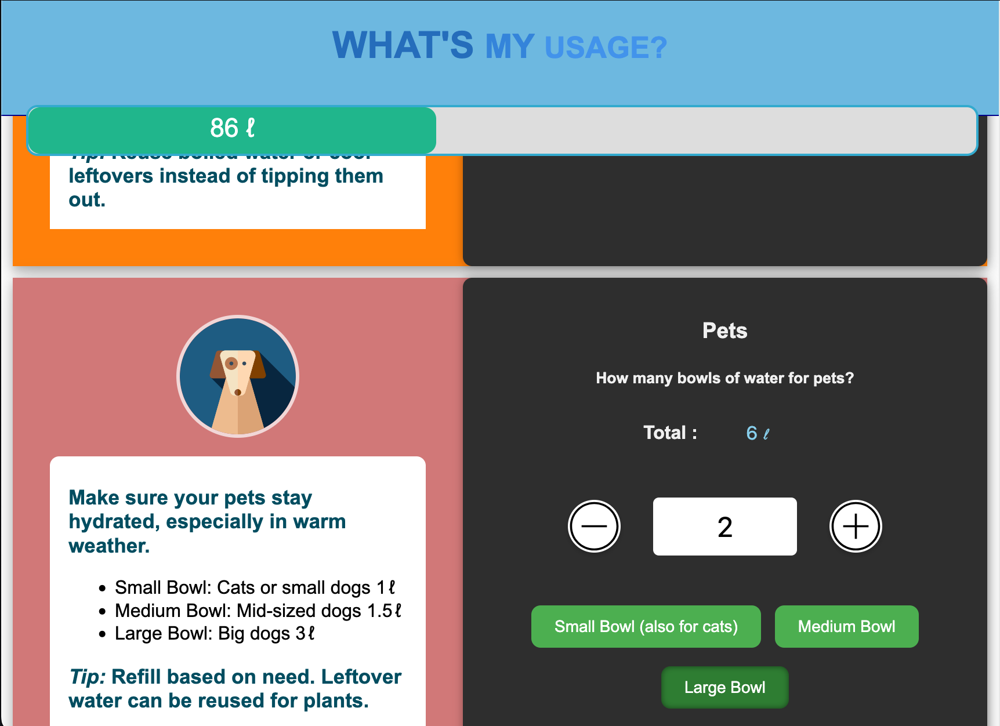

# 💧 CT Water Calculator

A lightweight browser-based tool built during Cape Town’s 2018 water crisis to help households visualize and manage daily water usage.

  
*Interactive section for tracking pet water consumption, with reuse tips and bowl size options*

In early 2018, Cape Town faced the possibility of “Day Zero” — the point at which municipal water supplies would be shut off to conserve what little was left in the dams.
Residents were urged to limit personal use to 50 liters per day. This tool was created to help households estimate and reduce their consumption through clear, activity-based inputs.

- Calculates daily water use with activity-based sliders
- Visual feedback using drought-relevant color bands
- Built with HTML, jQuery, and CSS for rapid prototyping and clarity

**Status:** Archived for reference and historical context. May be modernized in future.

## Technical Notes

> This project uses [jQuery](https://jquery.com/) and [jQuery UI](https://jqueryui.com/) for DOM manipulation and slider input. While jQuery is no longer a modern default, it offered fast iteration and intuitive interactivity. A future refactor may migrate to vanilla JavaScript or Alpine.js for leaner performance.

## Future Improvements (if revisited)

- Migrate to vanilla JS or Alpine.js
- Replace inline CSS with class-based logic
- Add mobile responsiveness and accessibility tweaks
- Improve parsing by separating display units from input values
- Add persistent data storage using localStorage
- Consider historical overlays or comparison modes

## License

Feel free to reuse or adapt with credit. Licensed under MIT.
